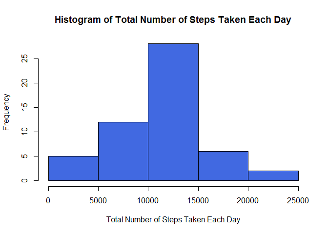
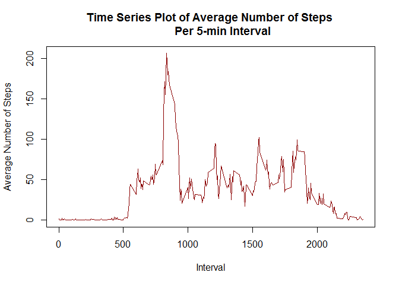
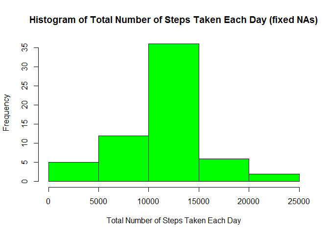
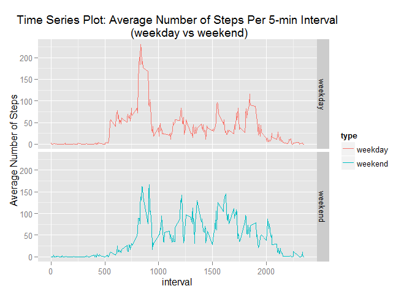

# Reproducible Research: Peer Assessment 1

The goal of the project is to perform some data analysis on an individual's number of steps taken in 5 minute intervals each day for two months -   
October and November 2012. This report summarizes the steps and results of the analysis.

## Loading and preprocessing the data

Read in the data file, activity.csv, and save to a data frame.  

```r
filename <- "activity.csv"
steps_data <- read.csv(filename)
```

## What is the mean total number of steps taken per day?

Calculate the total number of steps taken per day. Missing values are ignored. The dplyr package is used. Results are saved in a data frame.

```r
library(dplyr)
```

```
## 
## Attaching package: 'dplyr'
## 
## The following objects are masked from 'package:stats':
## 
##     filter, lag
## 
## The following objects are masked from 'package:base':
## 
##     intersect, setdiff, setequal, union
```

```r
steps_by_day <- group_by(steps_data, date)
steps_summary <- summarize(steps_by_day, total_steps = sum(steps, na.rm = TRUE))
```

This graphic display shows the histogram of the total number of steps taken each day.

```r
hist(steps_summary$total_steps, col = "royalblue", xlab = 
        "Total Number of Steps Taken Each Day", main = 
        "Histogram of Total Number of Steps Taken Each Day")
```

 

Calculate the mean and median of the total number of steps taken per day. Missing values are ignored.

```r
mean_total <- mean(steps_summary$total_steps, na.rm = TRUE)
median_total <- median(steps_summary$total_steps, na.rm = TRUE)
```

The mean total number of steps taken per day is

```r
print(mean_total)
```

```
## [1] 9354.23
```

The median total number of steps taken per day is

```r
print(median_total)
```

```
## [1] 10395
```

## What is the average daily activity pattern?

Calculate the total and mean number of steps per 5 minute interval across all days. Missing values are ignored. The dplyr package is used. Results are saved in a data frame.

```r
library(dplyr)
steps_by_interval <- group_by(steps_data, interval)
steps_timeseries <- summarize(steps_by_interval, mean_interval = mean(steps,
        na.rm = TRUE), total_interval = sum(steps, na.rm = TRUE))
```

The graphic display below shows the time series plot of the 5 minute interval and average number of steps taken across all days.

```r
with(steps_timeseries, plot(interval, mean_interval, type = "l",
        col = "darkred", xlab = "Interval", ylab = "Average Number of Steps",
        main = "Time Series Plot of Average Number of Steps 
        Per 5-min Interval"))
```

 

Determine the 5 minute interval, on average across all the days in the data set, that contains the maximum number of steps.

```r
max_5min <- steps_timeseries[which.max(steps_timeseries$total_interval), 1:3]
```

The 5 minute interval that contains the maximum number of steps is

```r
print(max_5min)
```

```
## Source: local data frame [1 x 3]
## 
##   interval mean_interval total_interval
##      (int)         (dbl)          (int)
## 1      835      206.1698          10927
```

Shown in the table above is the interval with the maximum number of steps, the mean number of steps for the interval and the total number of steps for the interval.

## Imputing missing values

Calculate and report the total number of missing values (i.e. NAs) in the dataset.

```r
total_NAs <- sapply(steps_data, function(x) sum(is.na(x)))
```

The table below shows the total number of missing values for each variable - *steps*, *date* and *interval*.

```r
print(total_NAs)
```

```
##    steps     date interval 
##     2304        0        0
```

Note that the missing values are all in the *steps* variable.

Missing values introduce bias into the calculations and summaries. In order to minimize bias, each missing value in the *steps* variable (i.e. the number of steps in a 5 minute interval) is replaced by the **mean** for the particular 5 minute interval. 


```r
steps_data$steps[is.na(steps_data$steps)] <- steps_timeseries$mean_interval[
        match(steps_data$interval[is.na(steps_data$steps)],
        steps_timeseries$interval)]
```

A new dataset is created which is the same as the original but with the missing data filled in. A new data file is created, activity-fixNA.csv.

```r
write.csv(steps_data, file = "activity-fixNA.csv", row.names = FALSE)
```

Using the data frame containing the new dataset, calculate the total number of steps taken each day. The dplyr package is used. Results are saved in a data frame.

```r
library(dplyr)

steps_by_day2 <- group_by(steps_data, date)
steps_summary2 <- summarize(steps_by_day2, total_steps = sum(steps, na.rm =TRUE))
```

The graphic display below shows the histogram of total number of steps taken each day, with missing values filled in.

```r
hist(steps_summary2$total_steps, col = "green", xlab = 
       "Total Number of Steps Taken Each Day", main = 
       "Histogram of Total Number of Steps Taken Each Day (fixed NAs)")
```

 

Calculate the mean and median of the total number of steps taken per day. Missing values are filled in using the mean for the particular 5 minute interval.

```r
mean_total2 <- mean(steps_summary2$total_steps, na.rm = TRUE)
median_total2 <- mean(steps_summary2$total_steps, na.rm = TRUE)
```

The resulting mean total number of steps taken per day is

```r
print(mean_total2)
```

```
## [1] 10766.19
```

The resulting median total number of steps taken per day is

```r
print(median_total2)
```

```
## [1] 10766.19
```

The mean and median calculated using the new dataset are slightly higher than those calculated in the first part of the assignment where missing values were ignored. Using the new dataset, the mean is equal to the median. This suggests that the distribution of total number of steps is symmetric. The histogram above supports this. The histogram shows that the distribution of the total number of steps taken per day now appears bell-shaped - close to a normal distribution. Imputing missing values lessened the bias on the calculations and summaries of the data.

## Are there differences in activity patterns between weekdays and weekends?

Create a new factor variable, *type*, in the new dataset with two levels - "weekday" and "weekend" indicating whether a given date is a weekday or weekend day.


```r
## Convert *date* variable from factor class to date class.
steps_data$date <- strptime(x = as.character(steps_data$date),
        format = "%Y-%m-%d")

## Define day variable using weekdays() function.
steps_data$day <- weekdays(steps_data$date)

## Create a new factor variable, type, in the dataset with two levels - 
## "weekday" and "weekend". Use the dataset with filled-in missing values.

weekend <- c("Saturday","Sunday")

steps_data$type <- factor(steps_data$day %in% weekend, 
        levels = c(FALSE,TRUE), labels = c("weekday", "weekend"))
```

Create a new data frame that will include only the important variables - *type*, *interval* and *steps*. Group the rows in the data frame by *type* and then by *interval*. For each *type* value and *interval*, the mean or average number of steps is calculated.


```r
library(dplyr)

steps_data2 <- steps_data[, c("type", "interval", "steps")]

type_interval <- group_by(steps_data2, type, interval)
steps_timeseries2 <- summarize(type_interval, mean_interval = mean(steps, na.rm = TRUE))
```

The graphic display below is a two-panel time series plot of the 5 minute interval and the average number of steps taken, averaged across all weekday days or weekend days. The ggplot2 package is used here.


```r
library(ggplot2)
p <- qplot(interval, mean_interval, data = steps_timeseries2, 
        geom = "line", facets = type~., ylab = "Average Number of Steps",
        main = "Time Series Plot: Average Number of Steps Per 5-min Interval
        (weekday vs weekend)", color = type)

print(p)
```

 

The two panel plot above shows differences in activity patterns between weekdays and weekends. For most 5 minute intervals, the average number of steps during weekends (mostly between 50 and 150 steps) are higher than on weekdays (mostly between 25 and 100 steps). There is a single spike in the weekday plot, however, where average number of steps is greater than 225.
